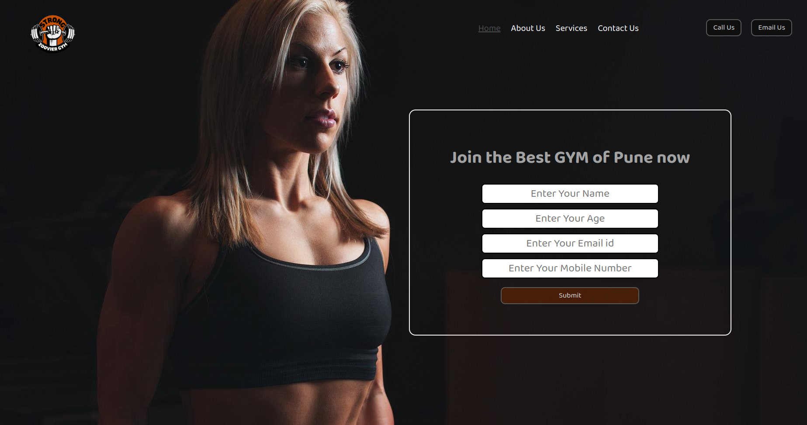

# AKSHAY MISHRA 
### (Aspiring Full Stack Javscript Web Developer)              

&nbsp;

&nbsp;

&nbsp;

## **Zoovier Gym** - Landing Page `(static page)`

&nbsp;

> ## **Project Description**

&nbsp;

This project is a gym landing page that contains a form for lead details. In this project, I learned to create a form with HTML and put a background image, and use of CSS property to get navbar with hover-button. I learned to use creativity with code and some basics of CSS, which makes the task very easier.
 

&nbsp;

I write the code with the proper comments to understand its reference easily to the other coder and also this page is not mobile responsive cause I am learning the execution of code, I want to inculcate the basics first. 
&nbsp;

### **Time Duration :  2.5hrs to complete this project**

&nbsp;

## **TECH STACK**

&nbsp;

 

&nbsp;

## **PROJECT SNAPSHOT**

&nbsp;

&nbsp;

## **LIVE PROJECT**

&nbsp;

&nbsp;

---
---

&nbsp;

&nbsp;

## **CHECK MY OTHER LIVE PROJECTS :**

 
 ##### (Click on Findcoder logo to check my portfolio of other projects.)

&nbsp;

## **Follow me on :**

##### (Follow me on Hashnode to read my articles on web development and lots of tips and tricks are coming soon for the coder community.)

